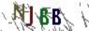
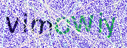

# 字母数字验证码图片的ocr识别

识别字母数字为内容的图片验证码。由于验证码中通常存在噪点，影响机器直接识别，需对图片进行：

- 基于 Jimp 的：

  - 边界像素及颜色擦除
  - 图片统一放大
  - 中性色过滤
  - 颜色标准化和对比度增强
  - 连通域去噪
  - 图像二值化
  - 形态学修复
  - 高斯模糊降噪，低频滤波
  - 图片统一缩小
- 基于 Tesseract 的：

  - 内容识别

## 内容描述

进行实验的对象为以下验证码

| 图像                       | 识别结果       | 来源 |
| -------------------------- | -------------- | ---- |
|  | Njgg ❌ NJBB   |      |
|  | AZsd ✔️      |      |
|  | 8MvHb ✔️     |      |
|  | VimoWiy ✔️   |      |
|  | iuczs ❌ iucz5 |      |
|  | m3dv8 ✔️     |      |
|  | wX84 ❌ WXB4   |      |
|  | MGRg ✔️      |      |

8个图片串行，耗时：34.737s

## 参考内容

[Cracking a Captcha with Tesseract.js](https://dev.to/kbravh/cracking-a-captcha-with-tesseract-js-jm)

[How To Solve 6 Letter Captchas With OCR In NodeJs](https://github.com/cracker0dks/CaptchaSolver/blob/master/docs/howToSolve6DigitCaptchasWalkthrough.md)

[tesseract.js api](https://github.com/naptha/tesseract.js/blob/master/docs/api.md)

[Jimp](http://jimp-dev.github.io/jimp/api/jimp/classes/jimp/)
